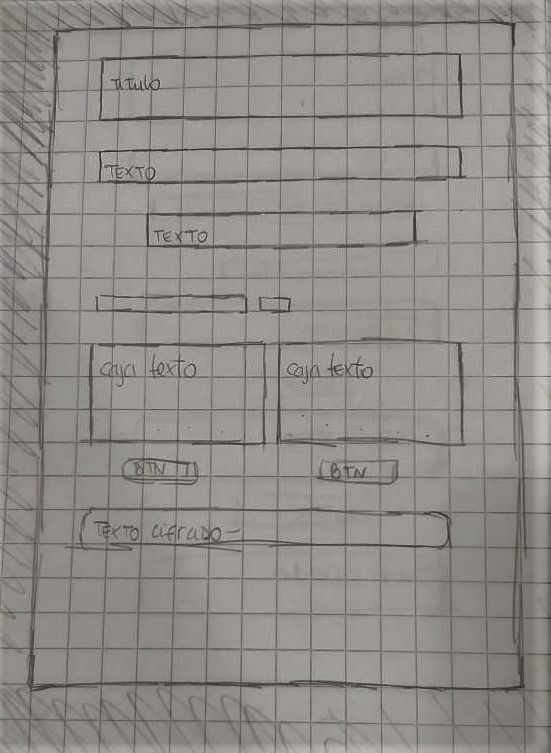
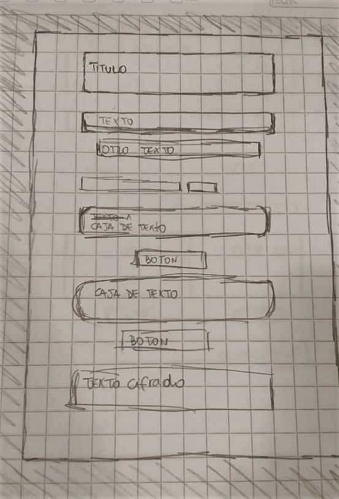

# SECRET LOVE 
Aplicación web que permite a los usuarios (parejas) enviar mensajes encriptados, dandoles tambien la posibilidad de desencriptarlos, y así poder comunicarse de forma secreta. 

## Cifrado Cesar

El cifrado césar es una de las técnicas más simples para cifrar un mensaje. Es un tipo de cifrado por sustitución, es decir que cada letra del texto original es reemplazada por otra que se encuentra un número fijo de posiciones (desplazamiento) más adelante en el mismo alfabeto.

Por ejemplo, si usamos un desplazamiento (_offset_) de 3 posiciones:

- La letra A se cifra como D.
- La palabra CASA se cifra como FDVD.
- Alfabeto sin cifrar: A B C D E F G H I J K L M N O P Q R S T U V W X Y Z
- Alfabeto cifrado: D E F G H I J K L M N O P Q R S T U V W X Y Z A B C

## Desarrollo de Aplicación

Para poder desarrollar esta aplicación utilizamos:
 * HTML5
 * JAVASCRIPT
 * CSS

## Instruciones de uso

PARA CIFRAR:

* elegir un offset de desplazamiento de 1 a 10.

* ingresar texto a cifrar.

* oprime boton "codificar".

* recibe tu mensaje codificado.

PARA DESCIFRAR:

* elegir un offset de desplazamiento (el mismo que se utilizo para codificar).

* ingresar texto a descifrar.

* oprime boton "decodificar".

* recibe tu mensaje decodificado.

## UX

Esta aplicación web esta creada para parejas entre los 14 y 17 años aprox. ya que generalmente lo padres tienden a revisar los celulares o computadores de sus hijos, y con esta aplicación ellos podrian mantener mensajes que sus padres no entenderian al ser revisados. 

Se realizaron distintos prototipos de baja y alta fidelidad y tambien testeos de usabilidad.

TEST DE USABILIDAD

